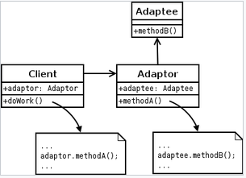
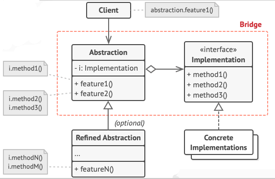
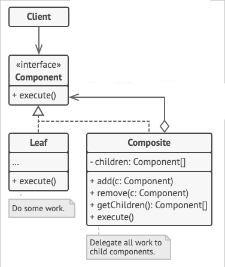
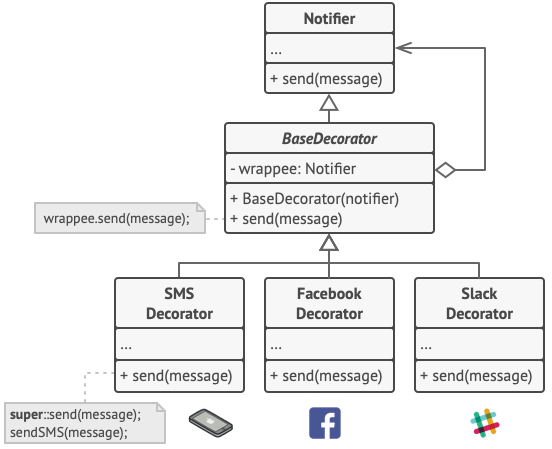
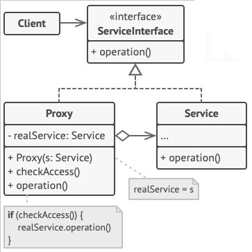

# Padrões criacionais
Tratam da criação do objeto de forma que desacopla e retira a responsabilidade do cliente lidar com as criações.
## design-pattern
Repositório para estudo dos design pattern com java.

## factory method
Existem algumas formas de fazer o padrão de criação Factory. Aqui foram implementadas algumas possibilidades.

## abstract factory
A ideia principal desse pattern é introduzir uma família de elementos dentro de um contexto. Por exemplo: se pensarmos em que o contexto é uma 'sala de jantar' poderíamos pensar nos elementos de mesma familia como mesas e cadeiras desse contexto de sala de jantar. Dessa forma eu posso criar uma AbstractFactory para sala de jantar que irá criar as mesas e cadeiras da forma desejada, como uma mesa moderna e cadeiras coloniais. 

# Padrões Estruturais
Os padrões estruturais se preocupa com a forma em que classes e objetos são compostos para formar estruturas maiores.

## Adapter
Converte a interface de uma classe em outra interface em que o cliente espera, ou seja, permite a comunição entre 2 classes incompativeis.

## Bridge
Bridge como o nome já sugere é uma ponte que facilita a comunicação entre dois aspectos, em que cada aspecto tem uma infinidade de variações. Dessa forma conseguimos construir hierarquias independentes, por exemplo formas geometricas e cores, podemos ter um quadrado vermelho e um triangulo vermelho, ou um quadrado azul e um triangulo rosa. O brigde permite essa variação de forma totalmente independente.

## Composite
A ideia do composite é tratar um conjunto de elementos como um unico elemento, dessa forma podemos trabalhar com a unidade, bem como compor a unidade em um conjunto e usar o conjuto como uma unidade.

## Decorator
O decorator nos permite introduzir novos comportamentos a objetos existentes em tempo de execução. Sem o decorator iriamos fazer isso causando uma explosão de subclasses.

## Proxy
O proxy traz a ideia de controlar o acesso a algum objeto adicionar funcionalidades durante o acesso de alguma funcionalidade. O um dos pontos mais positivos é que trazemos novas funcionalidade para o código sem impactar os clientes que já utilizam aquela determinada funcionalidade.

