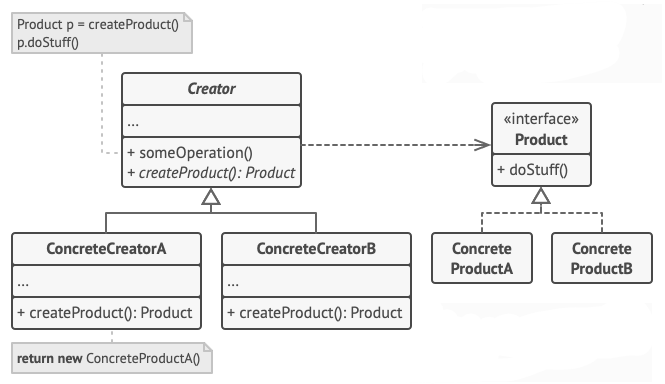
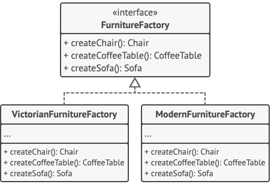

# design-pattern
Repositório para estudo dos design pattern com java.

# factory method
Existem algumas formas de fazer o padrão de criação Factory. Aqui foram implementadas algumas possibilidades.

# abstract factory
A ideia principal desse pattern é introduzir uma família de elementos dentro de um contexto. Por exemplo: se pensarmos em que o contexto é uma 'sala de jantar' poderíamos pensar nos elementos de mesma familia como mesas e cadeiras desse contexto de sala de jantar. Dessa forma eu posso criar uma AbstractFactory para sala de jantar que irá criar as mesas e cadeiras da forma desejada, como uma mesa moderna e cadeiras coloniais. 

